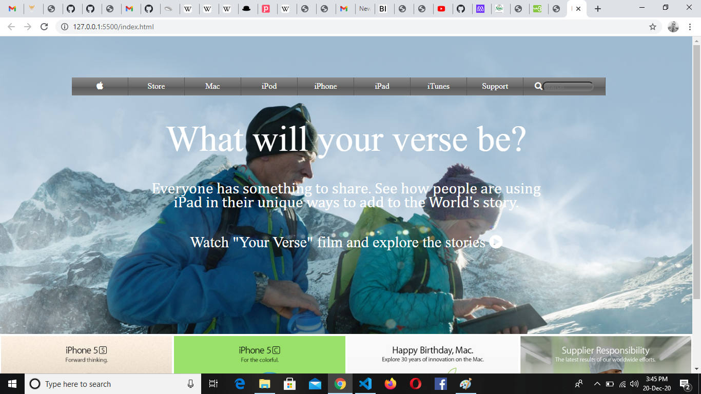
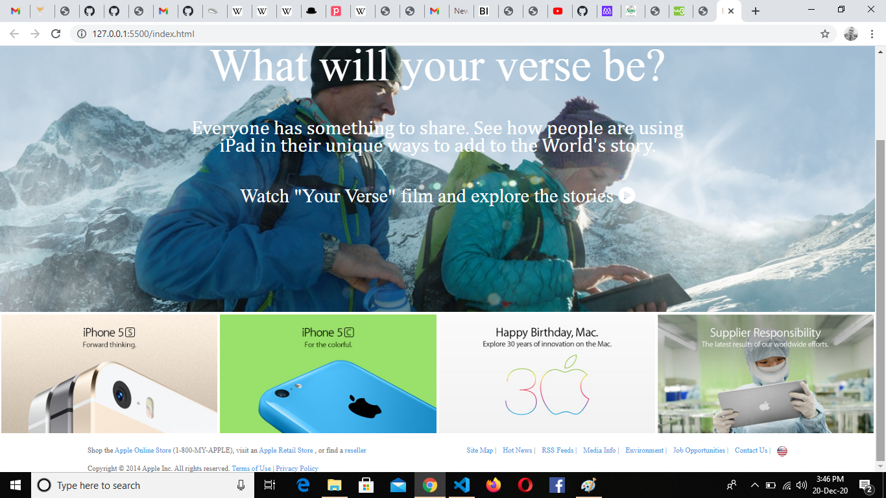

# New York Times - Clone

This is a clone application of New York Times.
 
 
 
 

 

In this project, our aim here wasn’t to produce an exact replica of the Apple Website, but rather to focus on how to use positioning declarations in CSS. That means two things – laying out the basic structure of the page using semantic HTML elements and ensuring that the elements are appropriately sized and positioned.

There are many elements on the New York Times page which are produced with Javascript but our objective in this project wasn't to give this page functionality, so except from a portion of the content where a youtube video is embedded, nothing nothing else is clickable.

## Built with
  * HTML 
  * CSS 
  

## Live demo
[Click here](https://rawcdn.githack.com/Habidoye97/ipone-clone/4172543d650664603c9f9c7f26bd83dd467ef6c1/index.html)

## Getting started
**For this project, we tried our best to recreate the Apple web page. The main aim is to ensure the elements get placed and styled roughly the same way as the New York Times page, so functionality is not a priority.**

We used the browser’s developer tools to inspect the real Apple page to understand how elements are placed and styled.
We built our own page in a .html text file and opened it in our browser to check it out. We carried out the following steps:
  - First setup a github repository for the project.
  - Then create a .html file where all our HTML markup will go
  - Create a .css file where all our styling code will reside
  - Then open the New York Times web page on https://web.archive.org/web/20140301004610/http://www.apple.com/, inspect its features with your browser's developer tools and start creating  :shipit:

## Author
 
 * Github: https://github.com/Habidoye97/
 
## Contributing
Contributions, issues and feature requests are welcome!

   1. Fork the Project
   2. Create your Feature Branch (git checkout -b feature/AmazingFeature)
   3. Commit your Changes (git commit -m 'Add some AmazingFeature')
   4. Push to the Branch (git push origin feature/AmazingFeature)
   5. Open a Pull Request

Feel free to check the [issues page](https://github.com/Habidoye97/ipone-clone/issues).

## Show your support
Give a :star: if you like this project!

## Acknowledgements
 
  * [The Odin Project](https://www.theodinproject.com/courses/html5-and-css3/lessons/embedding-images-and-video#introduction)

## License
 Distributed under the MIT License.